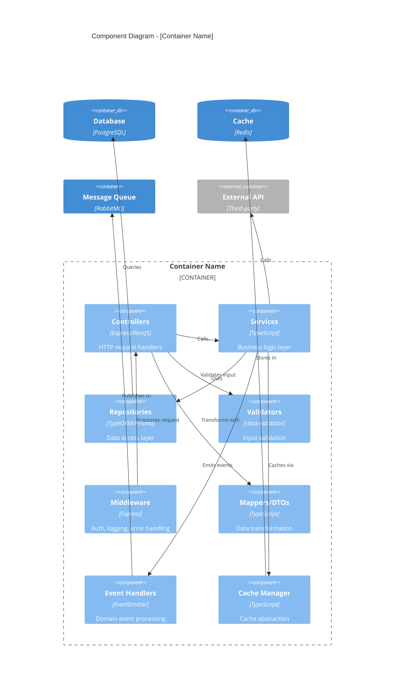
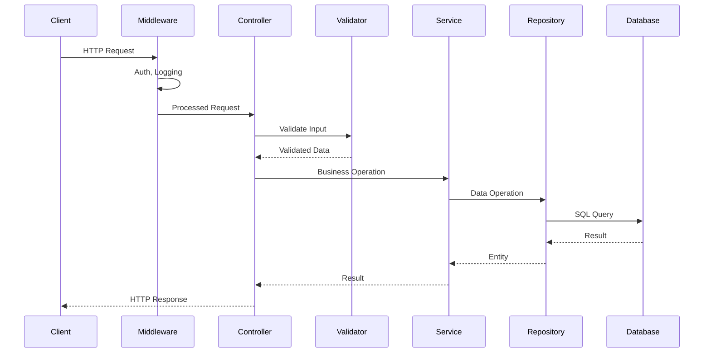
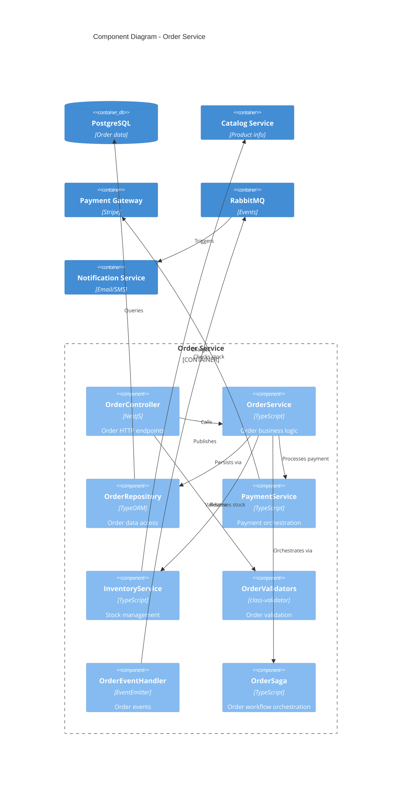

# C4 Component Diagram Template

## Overview

The C4 Component diagram zooms into an individual container to show the components inside it - the major structural building blocks and their interactions.

## Template

```markdown
# C4 Component Diagram: [Container Name]

## Overview

[Description of the container and its internal components]

## Diagram



## Components

### Request Processing Layer

| Component | Responsibility | Technology | Dependencies |
|-----------|---------------|------------|--------------|
| Middleware | Cross-cutting concerns | Express middleware | - |
| Controllers | HTTP handlers | NestJS Controllers | Services, Validators |
| Validators | Input validation | class-validator | DTOs |
| Mappers/DTOs | Data transformation | TypeScript classes | - |

### Business Logic Layer

| Component | Responsibility | Technology | Dependencies |
|-----------|---------------|------------|--------------|
| Services | Business rules | TypeScript classes | Repositories, Cache |
| Event Handlers | Domain events | EventEmitter | Services |

### Data Access Layer

| Component | Responsibility | Technology | Dependencies |
|-----------|---------------|------------|--------------|
| Repositories | Data persistence | TypeORM/Prisma | Database |
| Cache Manager | Caching abstraction | Custom adapter | Redis |

## Component Details

### Controllers

```
[FeatureController]
├── GET    /api/resource        → list()
├── GET    /api/resource/:id    → findOne()
├── POST   /api/resource        → create()
├── PUT    /api/resource/:id    → update()
├── DELETE /api/resource/:id    → delete()
└── Dependencies: FeatureService, Validators
```

### Services

```
[FeatureService]
├── findAll(filters)     → Repository.find()
├── findById(id)         → Repository.findOne() + Cache
├── create(data)         → Validate + Repository.save() + Events
├── update(id, data)     → Repository.update() + Cache.invalidate()
├── delete(id)           → Repository.delete() + Events
└── Dependencies: Repository, CacheManager, EventEmitter
```

### Repositories

```
[FeatureRepository]
├── find(options)        → SELECT with filters
├── findOne(id)          → SELECT by ID
├── save(entity)         → INSERT/UPDATE
├── delete(id)           → DELETE
└── Dependencies: Database connection
```

## Interactions

### Request Flow



### Error Handling Flow

[Describe how errors propagate through components]

### Caching Strategy

[Describe caching patterns used]

## Design Patterns Used

| Pattern | Where Used | Purpose |
|---------|-----------|---------|
| Repository | Data Access | Abstract database operations |
| Service Layer | Business Logic | Encapsulate business rules |
| DTO | Request/Response | Data transfer objects |
| Dependency Injection | Throughout | Loose coupling |
| Observer | Events | Decouple side effects |

## Notes

[Additional implementation notes]
```

## Example

```markdown
# C4 Component Diagram: Order Service

## Overview

The Order Service handles all order-related operations including order creation, payment processing, status updates, and order history.

## Diagram



## Components

### OrderController

**Endpoints:**
- `POST /orders` - Create new order
- `GET /orders/:id` - Get order details
- `GET /orders` - List user orders
- `PUT /orders/:id/cancel` - Cancel order
- `GET /orders/:id/status` - Get order status

### OrderService

**Operations:**
- `createOrder(dto)` - Validate, reserve inventory, process payment, create order
- `getOrder(id)` - Fetch order with items
- `cancelOrder(id)` - Reverse payment, release inventory, update status

### OrderSaga

**Workflow:**
1. Validate order items
2. Reserve inventory
3. Process payment
4. Create order record
5. Emit OrderCreated event
6. (Compensation on failure)
```

## Best Practices

1. **Show all major components** - Controllers, services, repositories
2. **Include patterns** - Show how patterns are applied
3. **Detail interactions** - How components communicate
4. **Document responsibilities** - Clear separation of concerns
5. **Show external dependencies** - Other services, databases
