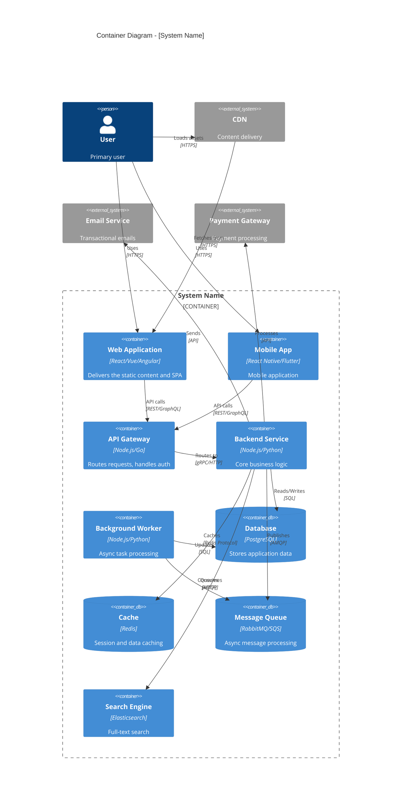
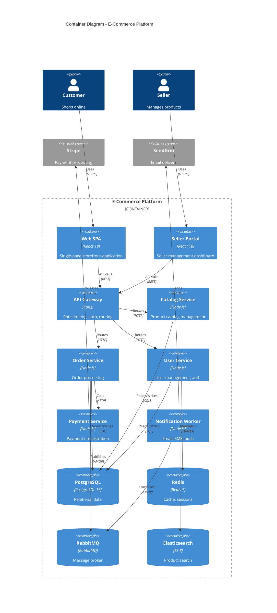

# C4 Container Diagram Template

## Overview

The C4 Container diagram zooms into the system boundary showing the high-level technology choices, how responsibilities are distributed, and how containers communicate.

## Template

```markdown
# C4 Container Diagram: [System Name]

## Overview

[Description of the system's container architecture]

## Diagram



## Containers

### Frontend Containers

| Container | Technology | Purpose | Scaling Strategy |
|-----------|------------|---------|------------------|
| Web Application | React + TypeScript | Browser-based UI | CDN + Static hosting |
| Mobile App | React Native | iOS/Android app | App stores |

### Backend Containers

| Container | Technology | Purpose | Scaling Strategy |
|-----------|------------|---------|------------------|
| API Gateway | Node.js + Express | Request routing, auth | Horizontal (load balanced) |
| Backend Service | Node.js + NestJS | Business logic | Horizontal (stateless) |
| Background Worker | Node.js + Bull | Async processing | Horizontal (queue-based) |

### Data Containers

| Container | Technology | Purpose | Scaling Strategy |
|-----------|------------|---------|------------------|
| Database | PostgreSQL 15 | Primary data store | Vertical + Read replicas |
| Cache | Redis 7 | Caching, sessions | Cluster mode |
| Message Queue | RabbitMQ | Async messaging | Cluster mode |
| Search Engine | Elasticsearch 8 | Full-text search | Cluster mode |

## Communication Patterns

### Synchronous

| From | To | Protocol | Purpose |
|------|-----|----------|---------|
| Web App | API Gateway | REST/HTTPS | User requests |
| API Gateway | Backend | gRPC | Internal routing |
| Backend | Database | TCP/SQL | Data persistence |

### Asynchronous

| From | To | Protocol | Purpose |
|------|-----|----------|---------|
| Backend | Message Queue | AMQP | Task publishing |
| Message Queue | Worker | AMQP | Task consumption |

## Security

### Authentication Flow

[Describe how authentication works across containers]

### Network Boundaries

[Describe network segmentation and security groups]

## Deployment

### Infrastructure

[Describe deployment infrastructure - Kubernetes, ECS, etc.]

### Container Orchestration

[Describe how containers are orchestrated]

## Notes

[Additional technical considerations]
```

## Example

```markdown
# C4 Container Diagram: E-Commerce Platform

## Overview

The E-Commerce Platform uses a microservices-oriented architecture with separate containers for web serving, API processing, and background tasks.

## Diagram



## Containers

### Frontend

| Container | Technology | Port | Replicas |
|-----------|------------|------|----------|
| Web SPA | React 18 + Vite | 80 | CDN |
| Seller Portal | React 18 + Vite | 80 | CDN |

### Backend Services

| Container | Technology | Port | Replicas |
|-----------|------------|------|----------|
| API Gateway | Kong 3.x | 8000 | 3 |
| Catalog Service | Node.js 20 + NestJS | 3001 | 3 |
| Order Service | Node.js 20 + NestJS | 3002 | 3 |
| User Service | Node.js 20 + NestJS | 3003 | 2 |
| Payment Service | Node.js 20 + NestJS | 3004 | 2 |
| Notification Worker | Node.js 20 + Bull | N/A | 2 |

### Data Stores

| Container | Technology | Storage | Backup |
|-----------|------------|---------|--------|
| PostgreSQL | 15.x | 500GB SSD | Daily |
| Redis | 7.x | 16GB RAM | AOF |
| RabbitMQ | 3.12 | 50GB SSD | Mirrored |
| Elasticsearch | 8.x | 200GB SSD | Snapshots |
```

## Best Practices

1. **Show all containers** - Include databases, caches, queues
2. **Label technologies** - Be specific about versions
3. **Show communication** - Protocols and data flow
4. **Group logically** - Use boundaries effectively
5. **Include external systems** - Show integration points
