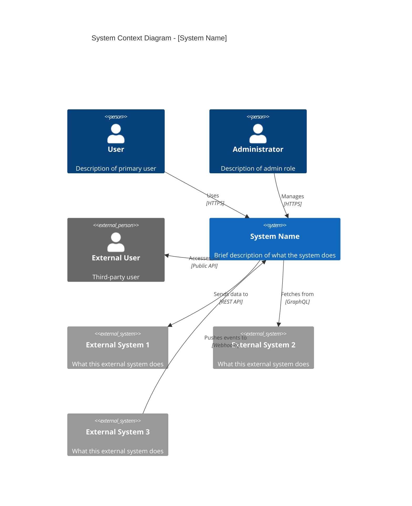
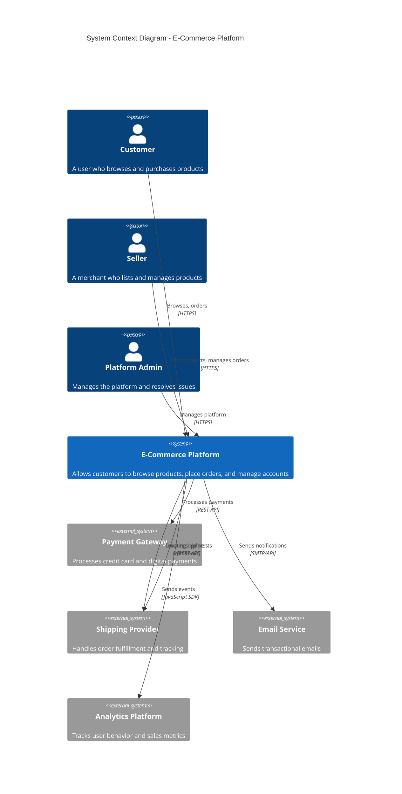

# C4 Context Diagram Template

## Overview

The C4 Context diagram shows the big picture of your system - how it fits into the world in terms of the people who use it and the other software systems it interacts with.

## Template

```markdown
# C4 Context Diagram: [System Name]

## Overview

[Brief description of the system and its purpose]

## Diagram



## Actors

| Actor | Type | Description | Responsibilities |
|-------|------|-------------|------------------|
| User | Internal | Primary user of the system | [Main activities] |
| Administrator | Internal | System administrator | [Admin activities] |
| External User | External | Third-party integration user | [Integration activities] |

## Systems

### Internal System

| Aspect | Description |
|--------|-------------|
| **Name** | [System Name] |
| **Purpose** | [What the system does] |
| **Technology** | [High-level tech stack] |
| **Owner** | [Team/Organization] |

### External Systems

| System | Type | Purpose | Integration |
|--------|------|---------|-------------|
| External System 1 | SaaS | [Purpose] | REST API |
| External System 2 | Database | [Purpose] | Direct connection |
| External System 3 | Third-party | [Purpose] | Webhooks |

## Relationships

| From | To | Description | Protocol | Data |
|------|-----|-------------|----------|------|
| User | System | User interactions | HTTPS | UI requests |
| System | Ext System 1 | Data sync | REST | JSON payloads |
| Ext System 3 | System | Event notifications | Webhooks | Event data |

## Key Interactions

### User → System

[Describe the main user interactions with the system]

### System → External Systems

[Describe how the system integrates with external systems]

### External → System

[Describe any inbound integrations]

## Security Boundaries

[Describe trust boundaries and security considerations at this level]

## Notes

[Any additional context or considerations]
```

## Example

```markdown
# C4 Context Diagram: E-Commerce Platform

## Overview

The E-Commerce Platform enables customers to browse products, place orders, and manage their accounts. It integrates with payment processors, shipping providers, and inventory management systems.

## Diagram



## Actors

| Actor | Type | Description | Responsibilities |
|-------|------|-------------|------------------|
| Customer | Internal | End user purchasing products | Browse, search, order, review |
| Seller | Internal | Merchant on the platform | List products, manage inventory, fulfill orders |
| Platform Admin | Internal | System administrator | User management, dispute resolution, platform config |

## External Systems

| System | Type | Purpose | Integration |
|--------|------|---------|-------------|
| Payment Gateway | SaaS (Stripe) | Process payments | REST API, Webhooks |
| Shipping Provider | SaaS (ShipStation) | Order fulfillment | REST API, Webhooks |
| Email Service | SaaS (SendGrid) | Transactional emails | REST API |
| Analytics | SaaS (Mixpanel) | User analytics | JavaScript SDK |
```

## Best Practices

1. **Keep it high-level** - Show systems, not internal details
2. **Focus on relationships** - How systems communicate
3. **Include all actors** - Both human and system
4. **Show data flow direction** - Use arrows meaningfully
5. **Label protocols** - HTTPS, REST, GraphQL, etc.
6. **Identify boundaries** - Security and trust boundaries
