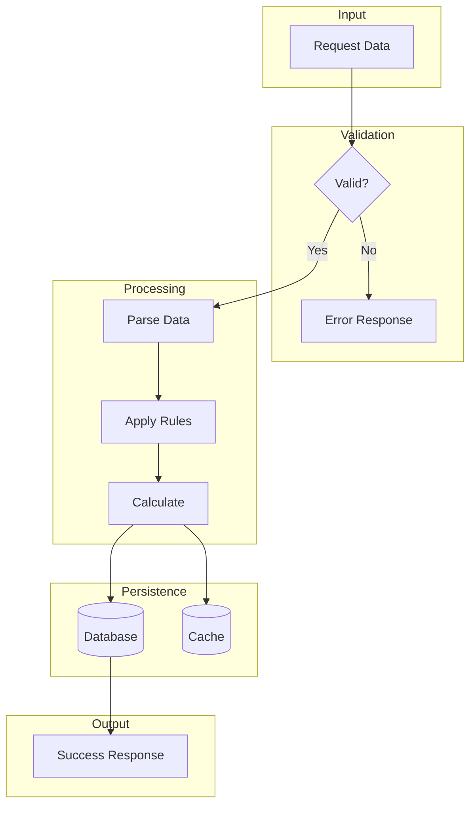

# Data Flow Diagram Template

## Overview

Data Flow Diagrams (DFD) show how data moves through a system, including inputs, outputs, data stores, and processes that transform data.

## Template

```markdown
# Data Flow Diagram: [Feature/Process Name]

## Overview

[Description of the data flow being documented]

## High-Level Data Flow

```mermaid
flowchart LR
    subgraph Input["📥 Input Sources"]
        A[User Input]
        B[External API]
        C[File Upload]
        D[Scheduled Job]
    end

    subgraph Process["⚙️ Processing"]
        E[Validation]
        F[Transformation]
        G[Business Logic]
        H[Enrichment]
    end

    subgraph Storage["💾 Storage"]
        I[(Primary DB)]
        J[(Cache)]
        K[(Search Index)]
        L[(File Storage)]
    end

    subgraph Output["📤 Output"]
        M[API Response]
        N[Notification]
        O[Report]
        P[Event]
    end

    A --> E
    B --> E
    C --> E
    D --> G
    E --> F
    F --> G
    G --> H
    H --> I
    H --> J
    H --> K
    H --> L
    I --> M
    G --> N
    I --> O
    G --> P
```



## Detailed Data Flows

### Flow 1: [Flow Name]



### Flow 2: [Another Flow Name]

[Similar diagram for another flow]

## Data Entities

### Input Data

| Entity | Source | Format | Validation Rules |
|--------|--------|--------|------------------|
| [Entity 1] | User form | JSON | Required fields, format validation |
| [Entity 2] | External API | JSON | Schema validation |
| [Entity 3] | File upload | CSV/Excel | File size, format, content validation |

### Processed Data

| Entity | Transformations | Business Rules |
|--------|-----------------|----------------|
| [Entity 1] | Normalization, enrichment | [Rule description] |
| [Entity 2] | Aggregation, calculation | [Rule description] |

### Output Data

| Entity | Destination | Format | Frequency |
|--------|-------------|--------|-----------|
| [Entity 1] | API Response | JSON | Real-time |
| [Entity 2] | Database | SQL rows | On event |
| [Entity 3] | Notification | Email/SMS | Async |

## Data Transformations

### Transformation 1: [Name]

```yaml
Input:
  - field1: string
  - field2: number

Process:
  - Normalize field1 to lowercase
  - Calculate derived_field = field2 * rate
  - Lookup reference data

Output:
  - field1_normalized: string
  - derived_field: number
  - reference_data: object
```

### Transformation 2: [Name]

[Similar structure]

## Data Stores

| Store | Type | Purpose | Retention |
|-------|------|---------|-----------|
| PostgreSQL | Primary DB | Transactional data | Indefinite |
| Redis | Cache | Session, computed data | TTL: 1 hour |
| Elasticsearch | Search | Full-text search | 90 days |
| S3 | Object Storage | Files, exports | Indefinite |

## Data Quality Rules

| Rule | Description | Action on Failure |
|------|-------------|-------------------|
| Required fields | All required fields must be present | Reject with error |
| Format validation | Email, phone, dates must match format | Reject with error |
| Referential integrity | Foreign keys must exist | Reject with error |
| Business rules | Custom validation logic | Reject or flag |

## Error Handling

### Validation Errors

[How validation errors are handled and returned]

### Processing Errors

[How processing errors are handled]

### Storage Errors

[How database/storage errors are handled]

## Audit Trail

| Event | Data Captured | Retention |
|-------|--------------|-----------|
| Create | Who, when, what | 7 years |
| Update | Who, when, before/after | 7 years |
| Delete | Who, when, what deleted | 7 years |

## Notes

[Additional considerations about data flow]
```

## Example

```markdown
# Data Flow Diagram: Order Processing

## Overview

This diagram shows how order data flows through the e-commerce system from cart checkout to order completion.

## High-Level Flow

```mermaid
flowchart LR
    subgraph Input["📥 Customer Input"]
        A[Shopping Cart]
        B[Payment Info]
        C[Shipping Address]
    end

    subgraph Validation["✓ Validation"]
        D[Cart Validation]
        E[Address Validation]
        F[Payment Validation]
    end

    subgraph Processing["⚙️ Order Processing"]
        G[Calculate Totals]
        H[Reserve Inventory]
        I[Process Payment]
        J[Create Order]
    end

    subgraph Storage["💾 Storage"]
        K[(Orders DB)]
        L[(Inventory DB)]
        M[(Payments DB)]
    end

    subgraph Output["📤 Output"]
        N[Order Confirmation]
        O[Email Notification]
        P[Inventory Update Event]
    end

    A --> D
    B --> F
    C --> E
    D --> G
    E --> G
    F --> I
    G --> H
    H --> L
    I --> M
    H --> J
    I --> J
    J --> K
    K --> N
    J --> O
    J --> P
```



## Data Entities

### Input Data

| Entity | Source | Format | Validation |
|--------|--------|--------|------------|
| Cart Items | Frontend | JSON array | Item exists, in stock, valid quantity |
| Payment | Stripe SDK | Token | Valid token, not expired |
| Address | User input | JSON object | Required fields, zip code format |

### Output Data

| Entity | Destination | Format |
|--------|-------------|--------|
| Order | Database | SQL record |
| Confirmation | Frontend | JSON |
| Notification | Email | HTML template |
```

## Best Practices

1. **Show data direction** - Use arrows to indicate flow
2. **Group logically** - Input, process, storage, output
3. **Include all stores** - Databases, caches, files
4. **Document transformations** - How data changes
5. **Show error paths** - What happens on failure
