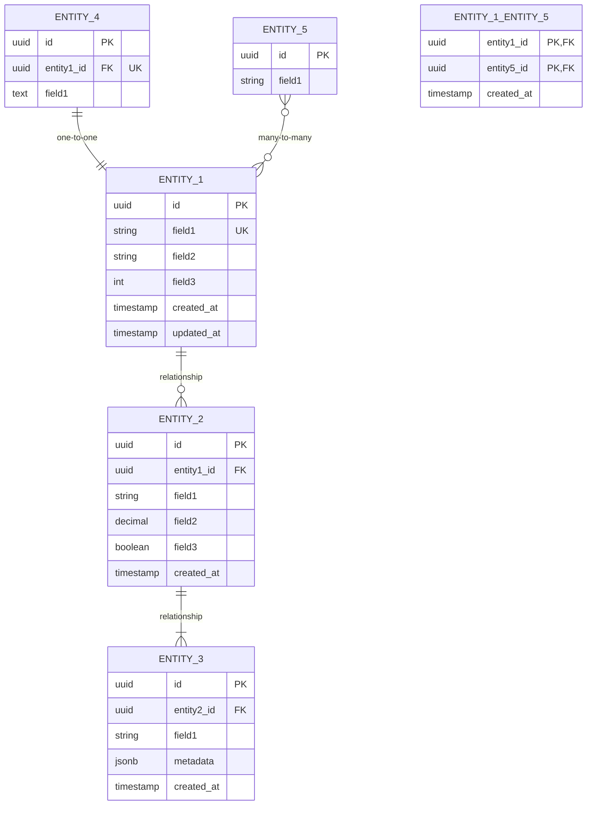
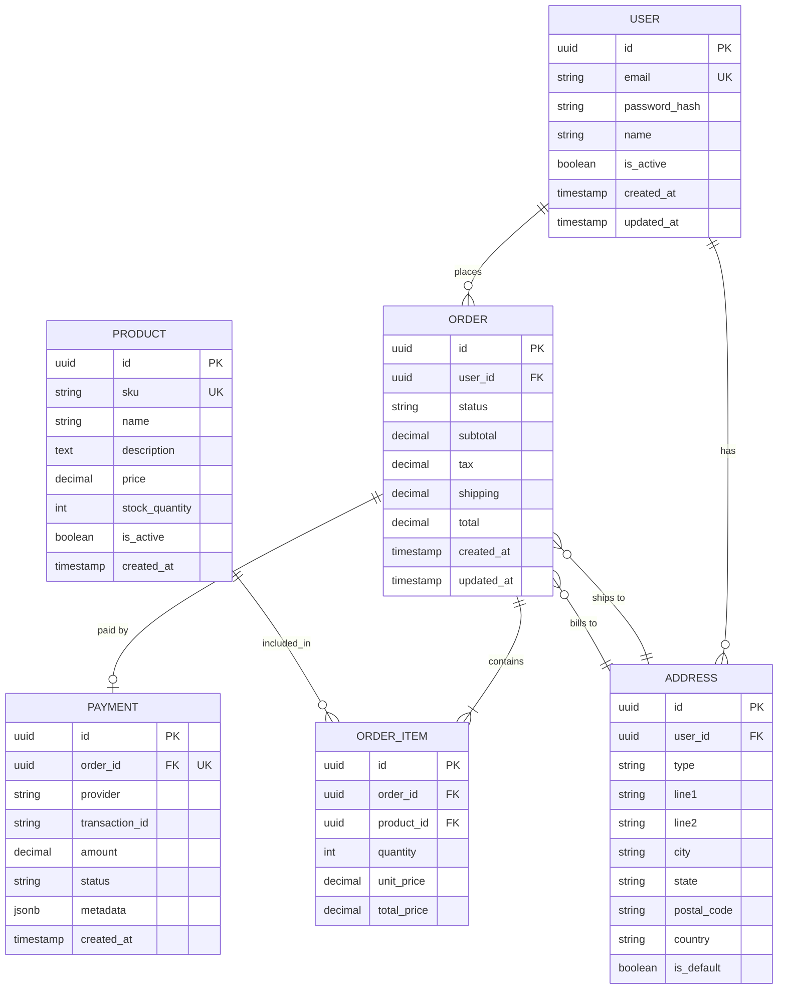

# Entity Relationship Diagram Template

## Overview

Entity Relationship Diagrams (ERD) document the data model showing entities, their attributes, and relationships between them.

## Template

```markdown
# Entity Relationship Diagram: [System/Feature Name]

## Overview

[Description of the data model and its purpose]

## Diagram



## Entities

### ENTITY_1

**Description**: [What this entity represents]

| Column | Type | Constraints | Description |
|--------|------|-------------|-------------|
| id | UUID | PK | Primary key |
| field1 | VARCHAR(255) | UK, NOT NULL | Unique identifier |
| field2 | VARCHAR(500) | | Optional field |
| field3 | INTEGER | DEFAULT 0 | Numeric field |
| created_at | TIMESTAMP | NOT NULL | Creation timestamp |
| updated_at | TIMESTAMP | | Last update timestamp |

**Indexes**:
- `idx_entity1_field1` on (field1)
- `idx_entity1_created_at` on (created_at)

### ENTITY_2

**Description**: [What this entity represents]

| Column | Type | Constraints | Description |
|--------|------|-------------|-------------|
| id | UUID | PK | Primary key |
| entity1_id | UUID | FK, NOT NULL | Reference to ENTITY_1 |
| field1 | VARCHAR(255) | NOT NULL | Required field |
| field2 | DECIMAL(10,2) | DEFAULT 0.00 | Monetary value |
| field3 | BOOLEAN | DEFAULT false | Flag field |
| created_at | TIMESTAMP | NOT NULL | Creation timestamp |

**Foreign Keys**:
- `fk_entity2_entity1` → ENTITY_1(id) ON DELETE CASCADE

**Indexes**:
- `idx_entity2_entity1_id` on (entity1_id)

### ENTITY_3

[Same structure as above]

## Relationships

| Relationship | Type | Description | Cardinality |
|--------------|------|-------------|-------------|
| ENTITY_1 → ENTITY_2 | One-to-Many | An ENTITY_1 has many ENTITY_2s | 1:N |
| ENTITY_2 → ENTITY_3 | One-to-Many | An ENTITY_2 has many ENTITY_3s | 1:N |
| ENTITY_1 ↔ ENTITY_4 | One-to-One | An ENTITY_1 has one ENTITY_4 | 1:1 |
| ENTITY_1 ↔ ENTITY_5 | Many-to-Many | ENTITY_1s have many ENTITY_5s | M:N |

## Relationship Details

### ENTITY_1 → ENTITY_2

- **Type**: One-to-Many
- **Required**: ENTITY_2 requires ENTITY_1
- **On Delete**: CASCADE (delete ENTITY_2 when ENTITY_1 deleted)
- **On Update**: CASCADE

### ENTITY_1 ↔ ENTITY_5 (Many-to-Many)

- **Junction Table**: ENTITY_1_ENTITY_5
- **On Delete**: CASCADE both sides
- **Additional Fields**: created_at (when relationship created)

## Data Types Reference

| Type | PostgreSQL | MySQL | SQLite |
|------|------------|-------|--------|
| UUID | uuid | CHAR(36) | TEXT |
| String | VARCHAR(n) | VARCHAR(n) | TEXT |
| Text | TEXT | TEXT | TEXT |
| Integer | INTEGER | INT | INTEGER |
| Decimal | DECIMAL(p,s) | DECIMAL(p,s) | REAL |
| Boolean | BOOLEAN | TINYINT(1) | INTEGER |
| Timestamp | TIMESTAMP | DATETIME | TEXT |
| JSON | JSONB | JSON | TEXT |

## Constraints

### Unique Constraints

| Entity | Constraint Name | Columns | Description |
|--------|-----------------|---------|-------------|
| ENTITY_1 | uk_entity1_field1 | (field1) | Ensure unique field1 |
| ENTITY_2 | uk_entity2_combo | (entity1_id, field1) | Composite unique |

### Check Constraints

| Entity | Constraint Name | Expression | Description |
|--------|-----------------|------------|-------------|
| ENTITY_2 | chk_entity2_field2 | field2 >= 0 | Non-negative amount |
| ENTITY_2 | chk_entity2_field1 | field1 IN ('A', 'B') | Allowed values |

## Indexes

### Performance Indexes

| Entity | Index Name | Columns | Type | Purpose |
|--------|-----------|---------|------|---------|
| ENTITY_1 | idx_entity1_field1 | (field1) | B-tree | Search by field1 |
| ENTITY_1 | idx_entity1_created | (created_at DESC) | B-tree | Recent records |
| ENTITY_2 | idx_entity2_fk | (entity1_id) | B-tree | Foreign key lookup |
| ENTITY_3 | idx_entity3_search | (field1) | GIN | Full-text search |

## Migration Notes

[Notes about schema migrations and versioning]

## Data Retention

| Entity | Retention Period | Archive Strategy |
|--------|------------------|------------------|
| ENTITY_1 | Indefinite | None |
| ENTITY_2 | 7 years | Move to archive table |
| ENTITY_3 | 90 days | Soft delete, then purge |

## Notes

[Additional considerations about the data model]
```

## Example

```markdown
# Entity Relationship Diagram: E-Commerce Orders

## Overview

This ERD documents the data model for the order management system, including users, orders, order items, products, and payments.

## Diagram



## Entities

### USER

| Column | Type | Constraints | Description |
|--------|------|-------------|-------------|
| id | UUID | PK | Primary key |
| email | VARCHAR(255) | UK, NOT NULL | User email |
| password_hash | VARCHAR(255) | NOT NULL | Hashed password |
| name | VARCHAR(255) | NOT NULL | Display name |
| is_active | BOOLEAN | DEFAULT true | Account status |
| created_at | TIMESTAMP | NOT NULL | Registration date |
| updated_at | TIMESTAMP | | Last update |

### ORDER

| Column | Type | Constraints | Description |
|--------|------|-------------|-------------|
| id | UUID | PK | Primary key |
| user_id | UUID | FK, NOT NULL | Customer |
| status | VARCHAR(50) | NOT NULL | pending/paid/shipped/delivered/cancelled |
| subtotal | DECIMAL(10,2) | NOT NULL | Items total |
| tax | DECIMAL(10,2) | DEFAULT 0 | Tax amount |
| shipping | DECIMAL(10,2) | DEFAULT 0 | Shipping cost |
| total | DECIMAL(10,2) | NOT NULL | Grand total |
```

## Best Practices

1. **Use proper notation** - PK, FK, UK for keys
2. **Document all relationships** - Cardinality and direction
3. **Include data types** - Be specific about types
4. **Show constraints** - Unique, check, foreign keys
5. **List indexes** - For query optimization
6. **Note retention** - Data lifecycle policies
