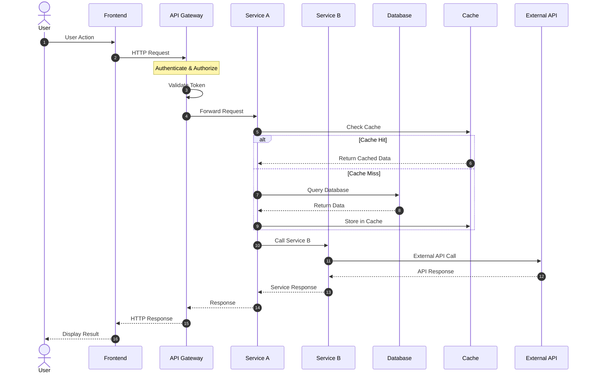
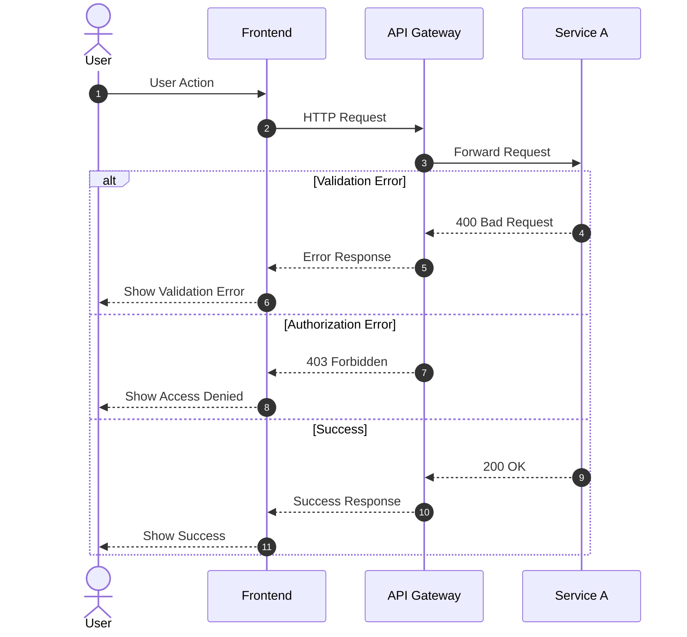
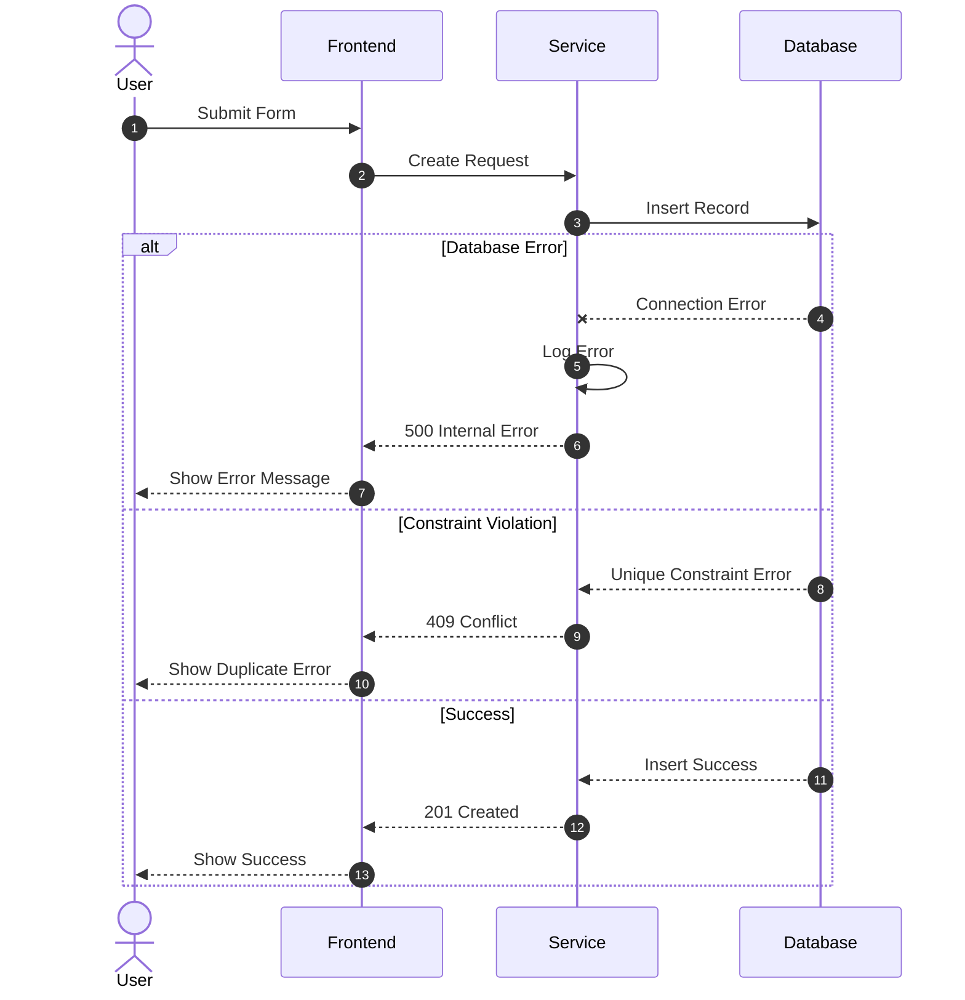
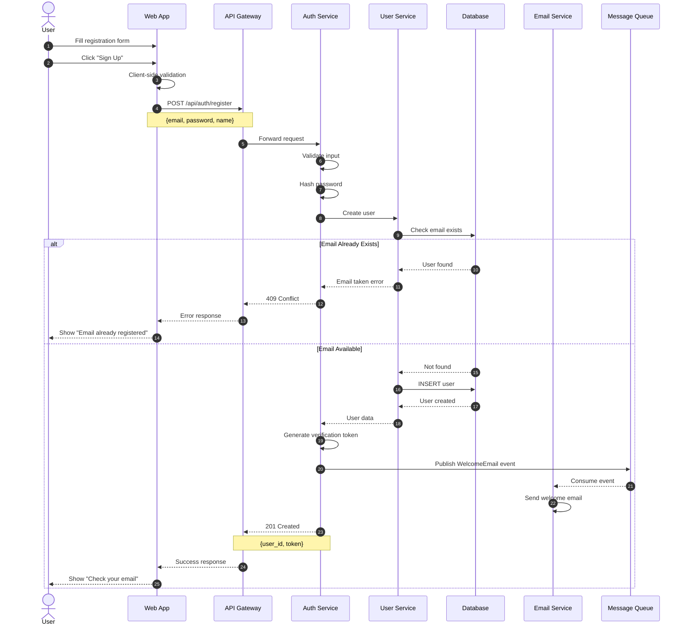

# Sequence Diagram Template

## Overview

Sequence Diagrams show the interactions between components over time, illustrating the flow of messages and the order of operations for specific use cases.

## Template

```markdown
# Sequence Diagram: [Use Case Name]

## Overview

[Description of the interaction being documented]

## Actors and Participants

| Participant | Type | Description |
|-------------|------|-------------|
| User | Actor | End user initiating the action |
| Frontend | System | Web/Mobile application |
| API Gateway | Service | Request routing and auth |
| Service A | Service | Primary business service |
| Service B | Service | Secondary service |
| Database | Storage | Data persistence |
| Cache | Storage | Caching layer |
| External API | External | Third-party service |

## Main Flow



## Alternative Flows

### Alt Flow 1: [Scenario Name]



### Alt Flow 2: [Error Scenario]



## Step-by-Step Description

### Main Flow Steps

| Step | From | To | Action | Data |
|------|------|-----|--------|------|
| 1 | User | Frontend | Initiates action | User input |
| 2 | Frontend | API Gateway | Sends request | HTTP payload |
| 3 | API Gateway | API Gateway | Validates auth | JWT token |
| 4 | API Gateway | Service A | Forwards request | Validated request |
| 5 | Service A | Cache | Checks cache | Cache key |
| 6 | Service A | Database | Queries if miss | SQL query |
| 7 | Service A | Service B | Calls dependent service | Internal request |
| 8 | Service B | External API | Calls external | API request |
| 9 | Service A | Frontend | Returns response | JSON response |

## Data Exchanged

### Request: [Endpoint]

```json
{
  "field1": "value",
  "field2": 123,
  "nested": {
    "field3": true
  }
}
```

### Response: Success

```json
{
  "id": "uuid",
  "status": "success",
  "data": {
    "field1": "value"
  }
}
```

### Response: Error

```json
{
  "error": {
    "code": "ERROR_CODE",
    "message": "Human readable message",
    "details": []
  }
}
```

## Timing Considerations

| Step | Expected Duration | Timeout | Notes |
|------|------------------|---------|-------|
| Auth validation | < 50ms | 1s | Cached tokens |
| Cache lookup | < 5ms | 100ms | Redis |
| Database query | < 100ms | 5s | Indexed |
| External API | 200-500ms | 10s | Third-party |
| Total | < 1s | 15s | End-to-end |

## Error Handling

| Error Type | HTTP Status | Recovery Action |
|------------|-------------|-----------------|
| Validation Error | 400 | Return validation details |
| Authentication | 401 | Redirect to login |
| Authorization | 403 | Show access denied |
| Not Found | 404 | Show not found page |
| Conflict | 409 | Show conflict details |
| Rate Limited | 429 | Show retry message |
| Server Error | 500 | Show generic error, log details |
| Service Unavailable | 503 | Show maintenance message |

## Notes

[Additional considerations about this interaction]
```

## Example

```markdown
# Sequence Diagram: User Registration

## Overview

This diagram shows the user registration flow from form submission to account creation and welcome email.

## Diagram



## Steps

| Step | Description | Duration |
|------|-------------|----------|
| 1-2 | User fills and submits form | User |
| 3 | Client validates input | < 10ms |
| 4-5 | Request sent to backend | ~50ms |
| 6-7 | Input validation, password hash | ~100ms |
| 8-9 | Check for existing user | ~20ms |
| 10-12 | Create user in database | ~50ms |
| 13-15 | Queue welcome email | ~10ms |
| 16-17 | Return success | ~20ms |

**Total: ~260ms** (excluding email send)
```

## Best Practices

1. **Number steps** - Use autonumber for clarity
2. **Show alternatives** - Use alt/else for branches
3. **Include notes** - Add context where needed
4. **Show async** - Indicate async operations
5. **Document data** - Show request/response formats
6. **Include timing** - Expected durations
7. **Handle errors** - Show error paths
